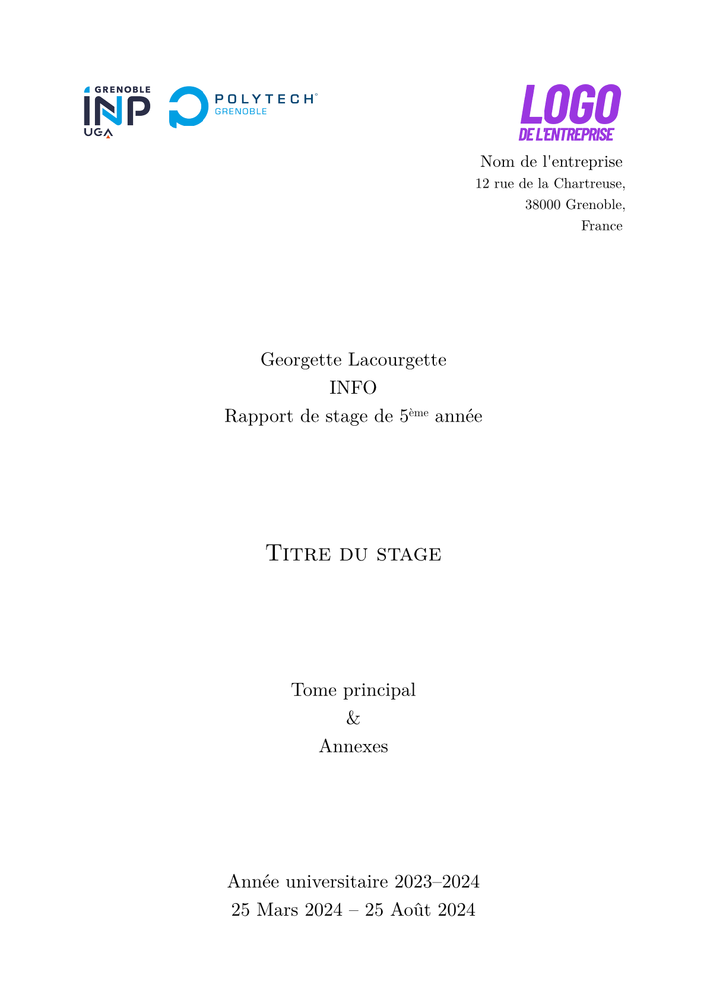

# Georges Yétyp

[Version anglaise](README.md)

Modèle Typst pour les rapports de stage à Polytech (Grenoble).

[](thumbnail.png)

## Utilisation

On peut soit passer par [l'application web Typst](https://typst.app/?template=georges-yetyp&version=0.1.0), ou utiliser la ligne de commande pour commencer un nouveau projet qui utilise ce modèle:

```bash
typst init @preview/georges-yetyp
```

Ensuite, il faut remplacer `logo.png` avec le logo de l'entreprise dans laquelle vous avez travailler, remplir les détails dans les paramètres de la fonction `rapport`, et commencer à écrire en dessous.

## Autres écoles

Supporter d'autres écoles du réseau Polytech devrait être relativement simple, si vous voulez réutiliser ce modèle. Il y a seulement besoin du logo de l'école (avec l'autorisation de l'utiliser). Les contributions sont les bienvenues.

## Résumés en plusieurs langages

On peut écrire une version française et anglaise du résumé de notre rapport en en faisant un dictionnaire en paramètre de notre appel de fonction :

```typst
    résumé: (
        fr: [
            Résumé en français.
        ],
        en: [
            English summary.
        ]
    )
```

## Documents supplémentaires dans les annexes

On peut ajouter des documents additionnels dans les annexes en utilisant le paramètre `annexes-extra` :

```typst
    annexes-extra: [
        #figure(image("document.png"),
            caption: [Document supplémentaire]
        )
    ]
```
